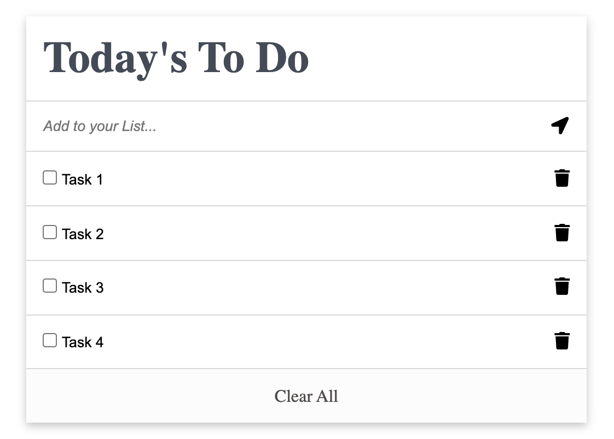

# TODO LIST APP

In this project, I have built a simple HTML list of To Do tasks. The list is styled according to the listed specifications . This simple web page will be built using webpack and served by a webpack dev server. I have implemented the CRUD (create, update, delete) methods. So all the elements of the user interface will be fully functional. I have added some functionality to my application to make it interactive. The user will also be able to mark task completion by selecting the corresponding checkbox (or undo it by unchecking the checkbox). The updated tasks list will be stored in local storage.



## Live Demo

[Live Demo Link]( https://selma-belhadj.github.io/To-Do-list-App/)

## Built With

- HTML
- CSS
- Javascript

## Prerequisites
- Linters
- GitHub Flow
- Javascript

## Getting Started

- clone the repository by running
``` git clone git@github.com:selma-belhadj/To-Do-list-App.git ```
- navigate to the folder
``` cd To-Do-list-App ```
- Install packages
``` npm install ```
- Run the app
``` npm start ```


## Authors

👤 **Selma Belhadj**

- GitHub: [@selma-belhadj](https://github.com/selma-belhadj)
- Twitter: [@Bel_Selma16](https://twitter.com/Bel_Selma16)
- LinkedIn: [@selma-belhadj](https://www.linkedin.com/in/selma-belhadj/)

## Show your support

Give a ⭐️ if you like this project!

## 📝 License

Thanks to [Ahmed](https://github.com/ahmedtaa) for this great idea.
Thanks to [Omar](https://github.com/omarsalem7) for this great webpack template.

